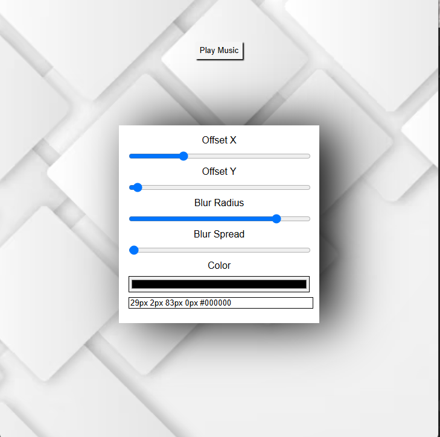

# box-shadow-generator
A simple web tool that lets users generate and preview CSS box-shadow values with live updates.
# 🎨 Box Shadow Generator

A simple web-based **CSS box-shadow generator** that lets you experiment with shadow properties using sliders and instantly preview the results. The generated CSS value can be copied and used directly in your own projects.  

---

## ✨ Features

- Adjust **Offset X**, **Offset Y**, **Blur Radius**, **Spread**, and **Color** using range inputs.  
- Live preview of the shadow effect on the demo box.  
- Automatically generates the CSS `box-shadow` value.  
- Copy-ready text field for quick use in your CSS.  
- Background music option with a play/pause button.  
- Responsive design (works on desktop and mobile)
